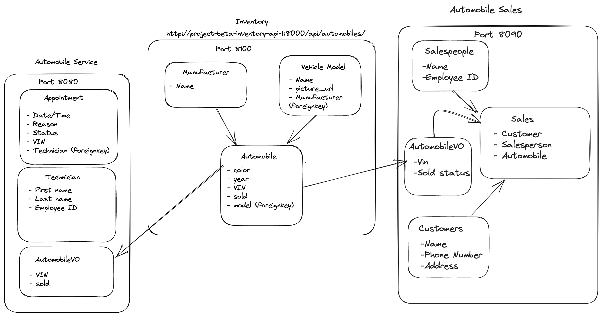

# CarCar

Team:

* **Dream Ramirez** - Automobile Service
* **Alvin Liang** - Automobile Sales

## How to Run this App
​
**Make sure you have Docker, Git, and Node.js 18.2 or above**
​
1. Fork this repository
​
2. Clone the forked repository onto your local computer:
git clone <<https://gitlab.com/atramirez7/project-beta>>
​
3. Build and run the project using Docker with these commands:
```
docker volume create beta-data
docker-compose build
docker-compose up
```
- After running these commands, make sure all of your Docker containers are running
​
- View the project in the browser: http://localhost:3000/

## Diagram
CarCar is made up of 3 microservices which interact with one another.

- **Inventory**
- **Service**
- **Sales**
​


## API Documentation

# Inventory

### Manufacturers

| Action | Request | URL
| ----------- | ----------- | ----------- |
| List manufacturers | GET | http://localhost:8100/api/manufacturers/
| Create a manufacturer | POST | http://localhost:8100/api/manufacturers/
| Manufacturer Detail | GET | http://localhost:8100/api/manufacturers/**id**/
| Update a manufacturer | PUT | http://localhost:8100/api/manufacturers/**id**/
| Delete a manufacturer | DELETE | http://localhost:8100/api/manufacturers/**id**/

Create a manufacturer
- Example **JSON body** to create a manufacturer
-You cannot create manufacters with the same **name** it is a unique field.

```
{
  "name": "Tesla"
}
```

Expected return value

```
{
	"href": "/api/manufacturers/1/",
	"id": 1,
	"name": "Tesla"
}
```
List manufacturers expected return value

```
{
	"manufacturers": [
		{
			"href": "/api/manufacturers/1/",
			"id": 1,
			"name": "Tesla"
		},
    ]
}
```

### Vehicles

| Action | Request | URL
| ----------- | ----------- | ----------- |
| List vehicle models | GET | http://localhost:8100/api/models/
| Create a vehicle model | POST | http://localhost:8100/api/models/
| Vehicle model detail | GET | http://localhost:8100/api/models/**id**/
| Update a vehicle model | PUT | http://localhost:8100/api/models/**id**/
| Delete a vehicle model | DELETE | http://localhost:8100/api/models/**id**/


Create a vehicle
- Example **JSON body** to create a Vehicle
-You cannot create manufacters with the same **name** it is a unique field.

```
{
  "name": "Tesla",
  "picture_url": "https://www.motortrend.com/uploads/sites/5/2020/07/2018-Tesla-Model-3-18.jpg",
	"manufacturer_id": 1
}
```

Expected return value
```
{
	"href": "/api/models/1/",
	"id": 1,
	"name": "Model 3",
	"picture_url": "https://www.motortrend.com/uploads/sites/5/2020/07/2018-Tesla-Model-3-18.jpg",
	"manufacturer": {
		"href": "/api/manufacturers/1/",
		"id": 1,
		"name": "Tesla"
	}
}
```
List vehicle models exprected return value

```
{
	"models": [
		{
			"href": "/api/models/1/",
			"id": 1,
			"name": "Model 3",
			"picture_url": "https://www.motortrend.com/uploads/sites/5/2020/07/2018-Tesla-Model-3-18.jpg",
			"manufacturer": {
				"href": "/api/manufacturers/1/",
				"id": 1,
				"name": "Tesla"
			}
		}
    ]
}
```

### Automobiles

| Action | Request | URL
| ----------- | ----------- | ----------- |
| List automobiles | GET | http://localhost:8100/api/automobiles/
| Create an automobile | POST | http://localhost:8100/api/automobiles/
| Automobile detail | GET | http://localhost:8100/api/automobiles/**vin**/
| Update a automobile | PUT | http://localhost:8100/api/automobiles/**vin**/
| Delete a automobile | DELETE | http://localhost:8100/api/automobiles/**vin**/

Note: We use **vin** here in the specifed urls instead of id's.

Create a automobile
- Example **JSON body** to create a automobile
```
{
  "color": "white",
  "year": 2013,
  "vin": "1HD1KEM1XDB602203",
  "model_id": 1
}
```
Expected return value
```
{
	"href": "/api/automobiles/1HD1KEM1XDB602203/",
	"id": 1,
	"color": "white",
	"year": 2013,
	"vin": "1HD1KEM1XDB602203",
	"model": {
		"href": "/api/models/1/",
		"id": 1,
		"name": "Model 3",
		"picture_url": "https://www.motortrend.com/uploads/sites/5/2020/07/2018-Tesla-Model-3-18.jpg",
		"manufacturer": {
			"href": "/api/manufacturers/1/",
			"id": 1,
			"name": "Tesla"
		}
	},
	"sold": false
}
```

List automobiles expected return value

```
{
	"autos": [
		{
			"href": "/api/automobiles/1HD1KEM1XDB602203/",
			"id": 1,
			"color": "white",
			"year": 2013,
			"vin": "1HD1KEM1XDB602203",
			"model": {
				"href": "/api/models/1/",
				"id": 1,
				"name": "Model 3",
				"picture_url": "https://www.motortrend.com/uploads/sites/5/2020/07/2018-Tesla-Model-3-18.jpg",
				"manufacturer": {
					"href": "/api/manufacturers/1/",
					"id": 1,
					"name": "Tesla"
				}
			},
			"sold": true
		},
    ]
}
```


## Value Objects
### Service microservice
VIN and sold (status) are polled from Inventory microservice and the values are stored in AutomobileVO model. The data is integrated in service microservice when creating an appointment if the VIN numbe provided for an appointment matched the VIN that polling from inventory, the vip status for that appoinment will be TRUE (is vip? = yes).

### Sales Microservice
Vin and sold status are polled from the Inventory microservice model Automobile and are used for the AutomobileVO model. The vin is used to record a sale of a vehicle and sold status is updated once the sale has been recorded.

### URLs and Ports


# Service microservice

Service microservice is used to keep track of **Technicians** with their first name, last name, and employee id; **Service Appointment** that contains the details collected in the form: VIN, customer name, date and time of the appointment, the assigned technician's name, and the reason for the service.
It polls data from **Inventory** microservice to get VIN and sold status. It has a special feature when VIN provided for an appointment exists in VIN inventory, that appointment will have VIP status.

## Endpoints to send and view data - through Insomnia

### Technician

| Action | Request | URL
| ----------- | ----------- | ----------- |
| List Technicians | GET | http://localhost:8080/api/technicians/
| Create a technician | POST | http://localhost:8080/api/technicians/
| Delete a specific technician	 | DELETE | http://localhost:8080/api/technicians/:id/

Creating a technician
- Example **JSON body** to create a technician

```
{
	"first_name": "Rocco",
	"last_name": "Tufts",
	"employee_id": "r_tufts"
}
```

Expected return value

```
{
	"first_name": "Rocco",
	"last_name": "Tufts",
	"employee_id": "r_tufts",
	"id": 7
}
```


List all technicians expected return value

```
{
	"technicians": [
		{
			"first_name": "Alex",
			"last_name": "Smiths",
			"employee_id": "a_smiths",
			"id": 3
		},
		{
			"first_name": "Alonso",
			"last_name": "Diez",
			"employee_id": "d_alonso",
			"id": 1
		},
		{
			"first_name": "Cecilia",
			"last_name": "Miranda",
			"employee_id": "cm_3022",
			"id": 4
		},
		{
			"first_name": "Miguel",
			"last_name": "Batista",
			"employee_id": "m_batista",
			"id": 2
		},
		{
			"first_name": "Rocco",
			"last_name": "Tufts",
			"employee_id": "r_tufts",
			"id": 7
		},
		{
			"first_name": "Susan",
			"last_name": "Thomas",
			"employee_id": "t_susan09",
			"id": 6
		}
	]
}
```

### Appoinment

| Action | Request | URL
| ----------- | ----------- | ----------- |
| List appointments | GET | http://localhost:8080/api/appointments/
| Create an appointment | POST | http://localhost:8080/api/appointments/
| Delete an appointment	 | DELETE | http://localhost:8080/api/appointments/:id/
| Set appointment status to "canceled"	 | PUT | http://localhost:8080/api/appointments/:id/cancel/
| Set appointment status to "finished"	 | PUT | http://localhost:8080/api/appointments/:id/finish/

Creating an appointment
- Example **JSON body** to create an appointment

```
{
	"date_time": "2023-06-04T12:00:00+00:00",
	"reason": "Oil Change",
	"vin": "2G2FV22G5X2221544",
	"customer": "Amanda M.",
	"technician_id": 1
}
```

Expected return value

```
{
	"date_time": "2023-06-04T12:00:00+00:00",
	"reason": "Oil Change",
	"status": "created",
	"vin": "2G2FV22G5X2221544",
	"customer": "Amanda M.",
	"vip": false,
	"id": 30,
	"technician": {
		"first_name": "Alonso",
		"last_name": "Diez",
		"employee_id": "d_alonso",
		"id": 1
	}
}
```


List all appointments expected return value

```
{
	"appointments": [
		{
			"date_time": "2023-06-10T14:05:00+00:00",
			"reason": "Tire Rotation",
			"status": "finished",
			"vin": "2G2FV22G5X2221544",
			"customer": "Jamie S.",
			"vip": false,
			"id": 20,
			"technician": {
				"first_name": "Cecilia",
				"last_name": "Miranda",
				"employee_id": "cm_3022",
				"id": 4
			}
		},
		{
			"date_time": "2023-06-10T21:54:00+00:00",
			"reason": "Oil Change",
			"status": "created",
			"vin": "2G2FV22G5X2221544",
			"customer": "Susan A.",
			"vip": false,
			"id": 28,
			"technician": {
				"first_name": "Alonso",
				"last_name": "Diez",
				"employee_id": "d_alonso",
				"id": 1
			}
		},
	]
}
```

# Sales microservice

Sales microservice keeps track of **Salespersons** personal info and a unique employee ID. Takes in **customer** info and stores them in a database for later use. The microservice can record a **Sale** takes information from **Salesperson** who sold the car and **customer** who purchased the car and puts them together in a convenient list.
It takes data from the **Inventory** microservice via polling service. It polls for AutomobileVO model to get automobile vins and sold status.

## Directions to create test data.
1. create a manufacturer
2. create a vehicle
3. create an automobile
4. Wait a minute (2 to be safe) after creating an automobile for the poller to poll the VIN information into Sales microservice AutomobileVO
5. Record a sale.


## Endpoints to send and view data - through Insomnia

### Customer

| Action | Request | URL
| ----------- | ----------- | ----------- |
| List Customers | GET | http://localhost:8090/api/customers/
| Customer Detail | GET | http://localhost:8090/api/customers/**id**/
| Create Customer | POST | http://localhost:8090/api/customers/
| Delete Customer | DELETE | http://localhost:8090/api/customers/**id**/


Creating a customer
- Example **JSON body** to create a customer

```
{
	"first_name": "Alvin",
	"last_name": "blah",
	"phone_number": "13279567",
	"address": "163 Alvin Blvd. San Francisco, CA"
}
```

Expected return value

```
{
	"first_name": "Alvin",
	"last_name": "blah",
	"phone_number": "13279567",
	"id": 4
}
```


List all customers expected return value

```
{
	"customer": [
		{
			"first_name": "Alvin",
			"last_name": "blah",
			"address": "163 Alvin Blvd. San Francisco, CA",
			"phone_number": 13279567,
			"id": 4
		}
    ]
}
```


### Salesperson

| Action | Request | URL
| ----------- | ----------- | ----------- |
| List Salespersons | GET | http://localhost:8090/api/salespeople/
| Salesperson Detail | GET | http://localhost:8090/api/salespeople/**id**/
| Create Salesperson | POST | http://localhost:8090/api/salespeople/
| Delete Salesperson | DELETE | http://localhost:8090/api/salespeople/**id**/


Creating a salesperson
- Example **JSON body** to create a salesperson
- You cannot create to employees with the same **employee_id** it is a unique field.

```
{
	"first_name": "Matt",
	"last_name": "Burger",
	"employee_id": "MBurger"
}
```

Expected return value

```
{
	"first_name": "Matt",
	"last_name": "Burger",
	"employee_id": "MBurger",
	"id": 10
}
```

List all salespersons expected return value

```
{
	"salesperson": [
        {
            "first_name": "Matt",
            "last_name": "Burger",
            "employee_id": "MBurger",
            "id": 10
        }
    ]
}
```


### Sale

| Action | Request | URL
| ----------- | ----------- | ----------- |
| List Sale | GET | http://localhost:8090/api/sales/
| Sale Detail | GET | http://localhost:8090/api/sales/**id**/
| Create Sale | POST | http://localhost:8090/api/sales/
| Delete Sale | DELETE | http://localhost:8090/api/sales/**id**/

Create a sale
- Example **JSON body** to create a sale
- Note the sold status is still False even after sale on Insomnia in the BackEnd. If sale made through FrontEnd it will update status that way.
```
{
	"price": 50000,
	"salesperson_id": 5,
	"customer_id": 4,
	"automobile": "1FTRW08L13KB17454"
}
```
Expected return value
```
{
	"price": 50000,
	"id": 43,
	"automobile": {
		"vin": "1FTRW08L13KB17454",
		"sold": false,
		"id": 21
	},
	"salesperson": {
		"first_name": "Chris",
		"last_name": "Blue",
		"employee_id": "CBlue",
		"id": 5
	},
	"customer": {
		"first_name": "Alvin",
		"last_name": "blah",
		"address": "163 Alvin Blvd. San Francisco, CA",
		"phone_number": 13279567,
		"id": 4
	}
}
```

List all sales expected return
```
{
	"sale": [
            "price": 32000,
            "id": 42,
            "automobile": {
				"vin": "JH4DC4460SS000830",
				"sold": true,
				"id": 20
			},
            "salesperson": {
				"first_name": "Jasper",
				"last_name": "Field",
				"employee_id": "JField",
				"id": 6
			},
			"customer": {
				"first_name": "Alex",
				"last_name": "Matt",
				"address": "Blah St.",
				"phone_number": 91103211,
				"id": 8
            }
        {
			"price": 50000,
			"id": 43,
			"automobile": {
				"vin": "1FTRW08L13KB17454",
				"sold": false,
				"id": 21
			},
			"salesperson": {
				"first_name": "Chris",
				"last_name": "Blue",
				"employee_id": "CBlue",
				"id": 5
			},
			"customer": {
				"first_name": "Alvin",
				"last_name": "blah",
				"address": "163 Alvin Blvd. San Francisco, CA",
				"phone_number": 13279567,
				"id": 4
            }
        }
        ]
}
```
